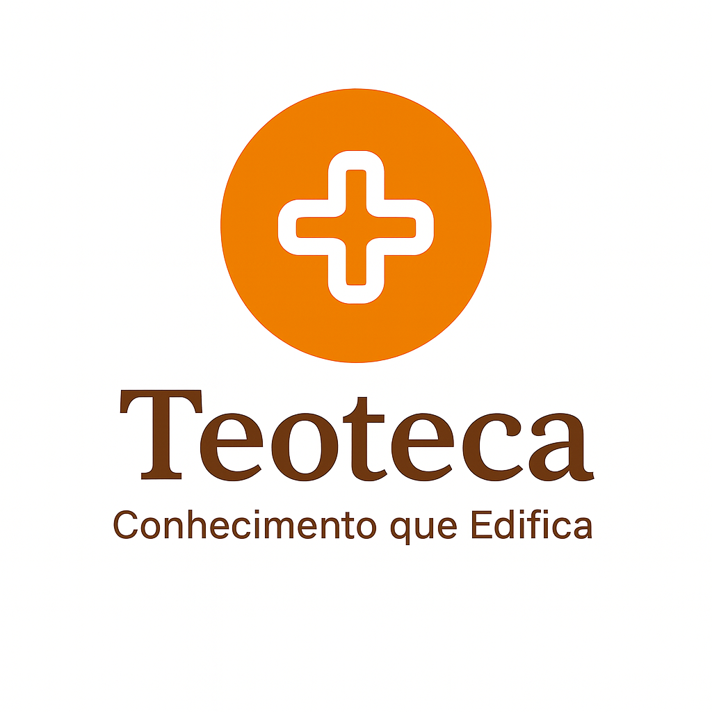

#  TeoTeca

> **Conhecimento que Edifica**

  

---

## Sobre o Projeto

A **TeoTeca** é um site voltado para reunir e preservar o conhecimento sobre a **história da Igreja e da Teologia Cristã**, com ênfase na **Teologia Reformada**.  
O objetivo é criar um espaço acessível e confiável que contenha informações desde os **primeiros escritos cristãos**, como o *Didaquê*, passando pelos **Pais da Igreja**, até **elementos fundamentais da teologia sistemática e histórica**.

---

## Tecnologias Utilizadas

- **HTML5** — estrutura das páginas  
- **CSS3** — estilização e responsividade  
- **JavaScript** — interatividade e manipulação dinâmica de dados  
- **MySQL** — armazenamento e gerenciamento de informações teológicas  
- **Web Data Viz API** — integração para visualização de dados teológicos de forma gráfica e interativa  

---

## Status do Projeto

📘 Projeto em desenvolvimento como parte da disciplina de **Pesquisa e Inovação** da **São Paulo Tech School - SPTech**.  

---

## Objetivos

- Criar uma base de conhecimento teológica acessível.  
- Organizar conteúdos de forma cronológica e temática.  
- Unir tradição e tecnologia para difundir o conhecimento cristão.  
- Servir como ferramenta de apoio para estudos e pesquisas.

---

## Autor

**Luan Iada**  
Criador e pesquisador responsável pelo projeto TeoTeca.
> “Toda a Escritura é inspirada por Deus e útil para o ensino, para a repreensão, para a correção e para a instrução na justiça,
para que o homem de Deus seja apto e plenamente preparado para toda boa obra.” – 2 Timóteo 3:16-17
